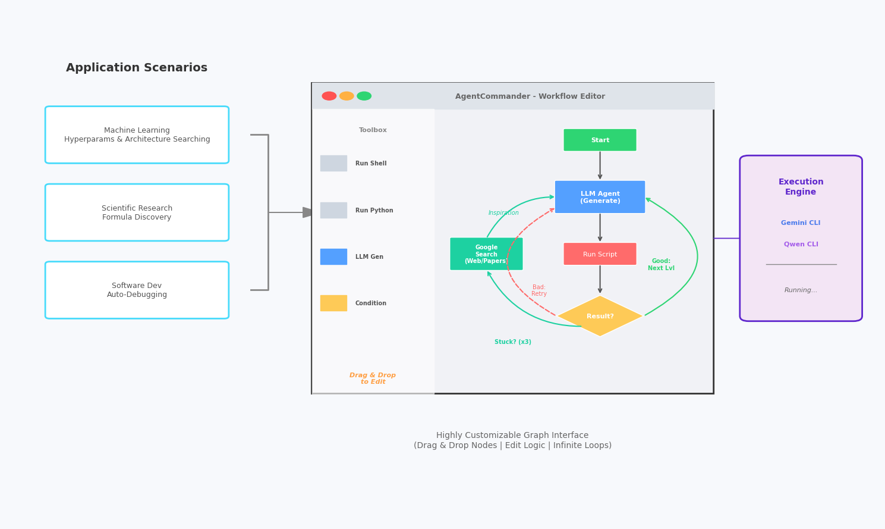
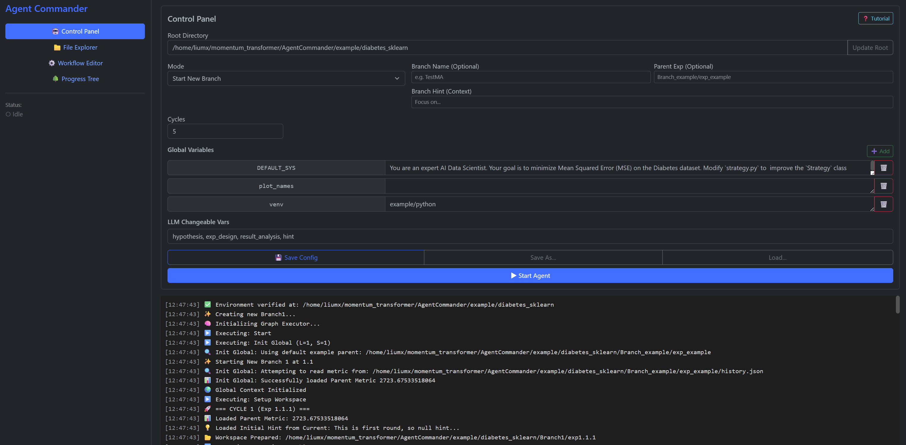
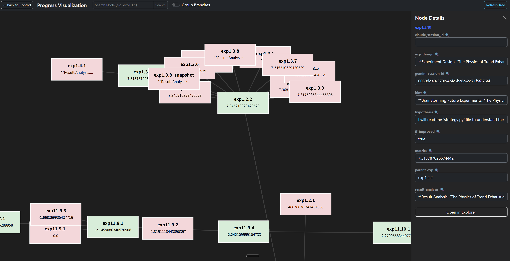

<div align="center">

# AgentCommander

**Automating the loop of discovery.**

[](https://mx-Liu123.github.io/AgentCommander/)

[](https://opensource.org/licenses/Apache-2.0)
[](https://www.python.org/downloads/)
[](https://ai.google.dev/)

</div>

---

## Motivation

Born from the complex computational needs of scientific research, AgentCommander addresses a critical bottleneck in machine learning: the exhaustive cost of manual trial-and-error. 

I attempted to iterate and optimize machine learning code using various existing tools, but found them lacking in flexibility. **Cursor Agent** excels at code completion but cannot design long-term evolutionary paths. **OpenEvolve/AlphaEvolve** offers powerful population-based evolution but focuses on group behavior rather than deep, customized single-agent optimization.

AgentCommander fills this gap. It is built on the belief that repetitive iteration is a task for machines, not humans. By automating the debugging and refinement cycle with a highly customizable graph-based workflow, AgentCommander empowers researchers to focus on high-level creative pursuits and systemic design.

## What is AgentCommander?



**AgentCommander was born from the actual demands of scientific research.**

Refined through rigorous practical application, it is a graph-based workflow engine designed to orchestrate AI Agents for complex, iterative tasks. Built to leverage the diverse ecosystem of **LLM CLIs** (Gemini, Qwen, Claude, etc.), it enables Machine Learning engineers to construct highly customizable, infinite-loop workflows.

### Key Capabilities

* **Symbolic Regression** Automating the search for mathematical expressions.
* **ML Structure/Hyperparameter Optimization** Intelligent tuning without manual intervention.
* **Autonomous Model Refinement** Self-correcting loops for model improvement.

---

## Contact
📧 **Email:** [miaoxin.liu@u.nus.edu](mailto:miaoxin.liu@u.nus.edu)



## Architecture & Safety

One of the primary challenges in autonomous coding agents is safety. We specifically chose to build upon **Gemini CLI** and **Qwen CLI** (derived from Gemini CLI) because they offer a robust foundation for **directory-level sandboxing**.

*   **Sandboxing**: Unlike other agent frameworks (e.g., Claude Code) where file system isolation can be difficult to enforce, the CLI-based approach allows AgentCommander to strictly limit the agent's read/write access to specific experiment directories. This ensures that the agent can freely experiment within its sandbox without risking modifications to your system-level files.
*   **Transparent Debugging (White-box)**: A major pain point with many agent frameworks is their "black-box" nature—if the agent gets stuck, you can't easily see why. In AgentCommander, every experiment runs in its own folder. You can simply `cd` into any experiment directory and run `gemini -r` (or `qwen -c`) to **resume the conversation exactly where the agent left off**. This gives you complete transparency and control to inspect the agent's thought process or manually intervene.
*   **HPC/PBS Server Support**: Beyond local execution, AgentCommander now supports high-performance clusters. The `example/pbs_server_example_tasks/` directory provides templates for PBS scripts (`run_all.pbs`) and job monitoring (`watch_job.sh`), specifically optimized and tested on the **NUS Vanda server**. These are integrated into the `pylib/pbs_example_graph.json` workflow.
    *   **Usage**: To use this, copy `pylib/pbs_example_graph.json` to `pylib/.cache/current_graph.json` to override the default workflow. Then, in the Control Panel UI, switch the experiment root directory to `example/pbs_server_example_tasks/`.

## Key Features

*   **Hierarchical Visual Workflow Editor with AI Assistant**: Adopts a sophisticated two-layer architecture to balance granular control with high-level evolution.
    *   **Inner Subloop (Experiment Lifecycle)**: Encapsulates the rigorous execution logic within a single experiment folder (e.g., Hypothesis Generation $\to$ Code Implementation $\to$ Evaluation $\to$ Result Analysis).
    *   **Outer Control Plane (Evolutionary Strategy)**: Orchestrates the macro-level logic *between* experiments. This layer manages **lineage inheritance** (cloning and mutating the best strategies), **meta-learning** (extracting lessons from failed branches), and **external exploration** (injecting fresh ideas via web search), ensuring the system evolves continuously rather than just iterating blindly.
    *   **AI-Assisted Design**: Modify this complex topology directly via natural language commands (e.g., "Add a shell check after step 2").

*   **Visual Feedback Loop (Sub-Loop)**: Capable of **multimodal analysis**. If your experiment generates plots (e.g., `best_result.png`), the workflow can feed them back to vision-capable agents (via `@filename` syntax). This allows the AI to perform qualitative analysis—such as spotting overfitting or bias—and adjust its strategy accordingly.
*   **Context-Aware File Explorer**: The built-in File Explorer features an embedded **AI Chat** that treats the currently open folder as its working directory. You can ask questions about your data ("Summarize history.json") and toggle **Read-Only Mode** for safe inspection.
*   **Multi-Model CLI Integration**: Deeply integrated with both **Gemini CLI** and **Qwen CLI** for powerful, prompt-driven code generation and analysis. Choose the backend that best fits your needs directly from the UI.
*   **Inherited CLI Skills**: Because it sits on top of the CLI ecosystem, AgentCommander inherits all the native capabilities of the underlying CLI tools. Any "skill" supported by Gemini/Qwen CLI (e.g., web search, file management, system commands) is automatically available to your agents within the workflow.
*   **Infinite Iteration & Advanced Learning**: Create self-improving loops where the agent experiments, learns from failures, and refines its strategy indefinitely. Advanced features like the **"Lesson" mechanism** (to learn from past errors) and **online search integration** (for inspiration) are available in example workflows to boost continuous improvement.
*   **ML & Symbolic Regression**: Specifically tailored to assist in discovering mathematical formulas and optimizing ML models through iterative experimentation.
*   **Experiment Management & Evolutionary Tree**: Automatically track and visualize experiment history, metrics, and branches as an **"evolutionary tree"**, where each experiment node connects to its parent.

*   **Dynamic Configuration**: Manage global variables and system settings through a centralized UI.

## Installation

### OS Support
*   ✅ **Linux & macOS**: Fully supported (native).
*   ⚠️ **Windows**: **Highly recommended to use WSL2** (Windows Subsystem for Linux). Native Windows support is limited due to the reliance on shell commands within workflows.

### Prerequisites
1.  **Gemini CLI** (Recommended): Ensure you have the **latest version** of the Gemini CLI installed. Older versions may not recognize newer model aliases, leading to "Model not found" errors.
    *   **Installation**: `npm install -g @google/gemini-cli@latest`
    *   **Node.js Warning**: If you see Node.js version warnings, please upgrade to the latest LTS to ensure CLI stability.
2.  **Qwen CLI** (Alternative): Support for the Qwen (Alibaba) CLI is also available.
    *   **Why Qwen?**: It provides an "OpenAI-compatible, OAuth free tier: use an OpenAI-compatible API, or sign in with Qwen OAuth to get 2,000 free requests/day." This allows for extensive experimentation with custom models and a generous free quota.
    *   *Ensure `qwen` is available in your system PATH.*

### Gemini CLI Configuration Recommendation
To leverage the latest capabilities, including the powerful Pro3 and Flash3 models, it is highly recommended to enable "Gemini Preview" in your Gemini CLI settings. This allows AgentCommander to access cutting-edge model versions.

*   **Note for Students**: Gemini currently offers a one-year free Pro user trial for student accounts. This is a great opportunity to explore the full potential of the latest Gemini models.

2.  **Python 3.10+**

### Steps
1.  **Clone the repository:**
    ```bash
    git clone https://github.com/yourusername/AgentCommander.git
    cd AgentCommander
    ```

2.  **Create and activate a virtual environment (Recommended):**
    ```bash
    conda create -n agent_commander python=3.10
    conda activate agent_commander
    ```
    *OR*
    ```bash
    python -m venv venv
    source venv/bin/activate  # On Linux/macOS
    # venv\Scripts\activate  # On Windows
    ```

3.  **Install dependencies:**
    ```bash
    pip install -r requirements.txt
    ```

## Quick Start

> 💡 **Tip**: Look for the **question mark (?) icon** in various parts of the UI (Control Panel, File Explorer, Workflow Editor). Clicking it will start a **guided tour** to help you understand the features of that specific section.

1.  **Start the UI Server:**
    *(If running for the first time, please rename `config_template.json` to `config.json` and configure it to match your environment).*
    ```bash
    bash run_ui.sh
    ```
    This will start the web server (default port 8080) and open the UI.

2.  **Access the UI:**
    Open your browser and navigate to `http://localhost:8080`.

3.  **Load Configuration:**
    *   The system will automatically create a default `config.json` if one is missing.
    *   You can load example configurations or create your own in the "Control Panel".

4.  **Run an Example Task:**
    *   Ensure the `Root Dir` in the Control Panel points to `example/diabetes_sklearn` (relative path).
    *   **Configure `eval_cmd`**: In the "Global Variables" section, ensure the `eval_cmd` variable contains the command to run your evaluation script (e.g., `/path/to/python -c "from evaluator import evaluate; print('Best metric:', evaluate('strategy.py'))"`). This is used by the workflow to run evaluation scripts.
    *   Click "Start Agent" to begin the automated experiment loop.
    *   Monitor progress in the "Console" and "Explorer" tabs.

## Project Setup Wizard (Auto-Setup)

For new projects, AgentCommander provides an **Auto-Setup Wizard** (`scripts/ml_autosetup_1/auto_setup.sh`) to instantly scaffold a robust experiment environment.

1.  **Prepare Data**: Place your features and labels in a directory as `X.npy` and `Y.npy`.
2.  **Run Wizard**: Execute `bash scripts/ml_autosetup_1/auto_setup.sh` and provide the path to your data directory when prompted.
3.  **Automated Scaffolding**: The script will:
    *   Split your data into development and reserved sets.
    *   Generate a **strict "Judge" (`evaluator.py`)**: This script acts as an immutable referee, ensuring execution integrity and error handling while outsourcing all creative degrees of freedom to `strategy.py`.
    *   Configure **Plugins**: Generates initial `metric.py` and `plot.py` which serve as non-modifiable plugins for the evaluator during the standard training flow.
    *   **Auto-configure `config.json`**: Automatically sets the `root_dir`, `eval_cmd`, and visual configurations.
4.  **One-Click Start**: Once the script finishes, simply launch the UI (`bash run_ui.sh`) and click **"Start Agent"**. Your workspace is already fully configured and ready to evolve.

## Reference Experiment Structure

To help you get started, the `example/diabetes_sklearn/` directory provides a reference implementation for organizing your machine learning experiments. This structure is designed to be robust and prevent "cheating" by the LLM.

### 1. File Organization
*   **Evaluation Script (`evaluator.py`)**: Placed within the experiment directory (e.g., `Branch_example/exp_example/evaluator.py`), this file serves as the ground truth for assessment. 
    *   **Anti-Leakage**: Our auto-setup template includes built-in checks to verify that the model does not modify the test set in memory, preventing common "cheating" bugs.
    *   **Time Limits**: It also enforces **Soft and Hard Time Limits** to prevent infinite loops.
    *   Since each experiment is self-contained, you can have different evaluation logic for different branches if needed. In strict mode, you should mark this file as read-only.
*   **Seed Experiment Directory (`Branch_example/exp_example/`)**: This folder acts as the "seed" for your evolutionary tree. It contains the initial `strategy.py` (the model or logic to be improved) and any auxiliary files required for execution.
*   **Experiment History (`history.json`)**: Within each experiment directory, `history.json` automatically stores all calculated metrics and the optimal results. The workflow can conveniently write key-value pairs into this file using the `write_history` module.

### 2. Execution Flow
In the default workflow, the agent evaluates a strategy by running a shell command similar to this:

```bash
cd {current_exp_path} && \
{eval_cmd} > eval_out.txt 2>&1; \
cat eval_out.txt
```

*   **Isolation**: The command changes directory to the specific experiment folder (`{current_exp_path}`).
*   **Context**: `evaluator.py` is present in the local directory, ensuring a self-contained execution environment.
*   **Output**: All generated files (metrics, logs, artifacts) remain contained within the experiment directory, ensuring a clean workspace for every iteration.

### 3. Hyperparameter Search Pattern
The provided example also demonstrates a pattern for hyperparameter optimization:
*   **`strategy.py`**: Defines both the model logic and the parameter space to be searched.
*   **`evaluator.py`**: Imports the strategy, reads the parameter space, and executes the search (e.g., Grid Search, Bayesian Optimization), returning the best metric found.

### 4. Evolutionary Progress Logic (B, L, S)
The example workflow uses a Branch (B), Level (L), Step (S) logic to manage evolutionary progress:
*   **Branch (B)**: A new branch is typically initiated manually, often when a significant breakthrough or new conceptual direction is explored.
*   **Level (L)**: Represents a progression in depth, advanced when an experiment shows significant improvement or a breakthrough.
*   **Step (S)**: Denotes different explorations within the same level when no breakthrough is achieved. Each new step is based on the optimal result from the previous (L-1) level, allowing for iterative refinement.

This mechanism is implemented within the example workflow and is fully modifiable by the user to suit their specific progress tracking needs.

### Note on Customization
Because the AgentCommander workflow is graph-based and highly customizable, this structure is merely a **recommendation**. You are free to modify the folder hierarchy, execution commands, and evaluation logic to fit the specific needs of your project.

## Configuration

The `config.json` file controls the core behavior of the agent system. You can manage this file directly via the UI's "Control Panel".

*   **root_dir**: The working directory where experiments and data are stored.
*   **n_cycles**: The number of experiment iterations to run.
*   **global_vars**: These are hardcoded environment variables (e.g., `eval_cmd` for the evaluation command, system paths) accessible throughout the workflow.
*   **workflow**: The workflow definition graph. Can be a full JSON object or a string path to a separate JSON file (e.g., `"my_workflows/workflow_v1.json"`).
*   **Shared Context**: All nodes in the workflow exchange data through a shared variable pool, known as the `context`. This allows for flexible data flow between different modules without strict parameter passing.

### File Permission Modes (LLM Nodes)
To prevent LLM agents from modifying unauthorized files, AgentCommander implements a strict **File Permission System** for each `llm_generate` node. Each mode can also specify whether to `Allow Creating NEW Files`.

*   **Strict (Read-Only) [Default for New Nodes]**: The LLM is strictly forbidden from modifying existing files.
    *   If `Allow Creating NEW Files` is **unchecked**: The LLM cannot create any new files.
    *   If `Allow Creating NEW Files` is **checked**: The LLM can create new files, but cannot modify existing ones.
*   **Restricted (Whitelist Only)**: The LLM can only modify the files or folders explicitly listed in the configuration (`target_files` - e.g., `strategy.py`, `lib/`).
    *   If `Allow Creating NEW Files` is **unchecked**: The LLM can only create new files if their paths match the whitelist (i.e., new files are treated as existing files for modification purposes).
    *   If `Allow Creating NEW Files` is **checked**: The LLM can create any new files, in addition to modifying whitelisted existing files.
*   **Restricted (Blacklist)**: The LLM is forbidden from modifying or creating files/folders explicitly listed in the configuration (`target_files`). All other files/folders are editable.
    *   If `Allow Creating NEW Files` is **unchecked**: The LLM cannot create any new files (unless they are explicitly whitelisted, which is not typical for blacklist mode). This option essentially means no new files are allowed globally, overriding the blacklist's default "allow everything else" behavior for new files.
    *   If `Allow Creating NEW Files` is **checked**: The LLM can create new files, provided they are not on the blacklist.
*   **Open (Allow All)**: The LLM has unrestricted access to modify and create files within the working directory. (`Allow Creating NEW Files` option has no effect in this mode, as it's implicitly allowed).

**Enforcement Mechanism**:
For "Strict", "Restricted (Whitelist)", and "Restricted (Blacklist)" modes, the system creates a **filesystem snapshot** of the experiment directory before the LLM executes. After execution, it compares the directory state with the snapshot. Any unauthorized changes (modifications, creations, or deletions) are immediately **reverted** to maintain integrity. A strict system instruction is also injected into the prompt to warn the LLM about the current file permission constraints.

## Tips & Best Practices

*   **Optimizing ML Parameter Search**: For a good balance between model iteration speed and computational cost, a duration of **20-30 minutes** for an `exp` directory coupled with ML parameter searching is often a cost-effective approach. This allows sufficient exploration without excessive expenditure.
*   **Prompt Templating**: Within `llm_generate` nodes, you can use Jinja2-like templating syntax (e.g., `{{ variable_name }}`) to dynamically inject values from the shared context into your prompts. This is crucial for creating adaptive and data-driven agents.
*   **Debugging Prompts with `gemini -r`**: After running your workflow, you can use the `gemini -r` command in the corresponding experiment directory (`cd {exp_path} && gemini -r`) to restore the latest conversation. This allows you to inspect the exact prompt that was sent to the LLM, verifying that your templating and context variables are working as expected.
*   **CLI Hygiene & Isolation**: To prevent context pollution between different projects, consider setting your global CLI history file (e.g., `~/gemini/GEMINI.md` or similar) to **Read-Only** mode. This ensures that "Resume Latest" logic doesn't accidentally pull in memory from unrelated previous experiments, keeping each agent's evolution clean.

## Security Considerations & Disclaimer

While AgentCommander leverages the Gemini CLI, which primarily operates within its designated working directory, it's crucial to understand the inherent risks:

*   **CLI Model Access (Default YOLO Mode)**: By default, when invoked by AgentCommander, models (Gemini or Qwen) operate with the `-y` (YOLO - You Only Live Once) parameter. This means the model is granted permission to use *any* available tool and has *arbitrary privileges* within the working directory. This design choice enables powerful automation but requires extreme caution.
*   **File Access Scope**: The CLI tools typically focus on files within the specified working directory (`root_dir`). However, any generated scripts or commands executed by the agent **theoretically could interact with or modify files outside this directory**, especially if the agent's logic or your system's configuration allows it.
*   **Best Practices**: For maximum security, it is highly recommended to:
    *   **Use a Sandboxed Environment**: Run AgentCommander and its agents within a container (e.g., Docker) or a virtual machine.
    *   **Restrict User Permissions**: Execute the application and agents with a user account that has minimal necessary file system permissions, preventing unintended modifications to critical system files or sensitive data.
*   **Disclaimer**: This project is provided "as is," without warranty of any kind, express or implied. The developers are not responsible for any damage, loss of data, or security breaches resulting from the use or misuse of this software. Users are solely responsible for ensuring the secure operation of their environment and for validating any code or actions generated by the AI agents.

## Todo

*   [x] **Multi-backend Support**: Basic integration for Gemini, Qwen, and Claude-CLI.
*   [ ] **Parallel Workflow Example**: Add concrete examples and templates for running experiments in parallel.

## Contributing

Contributions are welcome! Please feel free to submit a Pull Request.

## License

This project is licensed under the Apache License 2.0 - see the [LICENSE](LICENSE) file for details.
